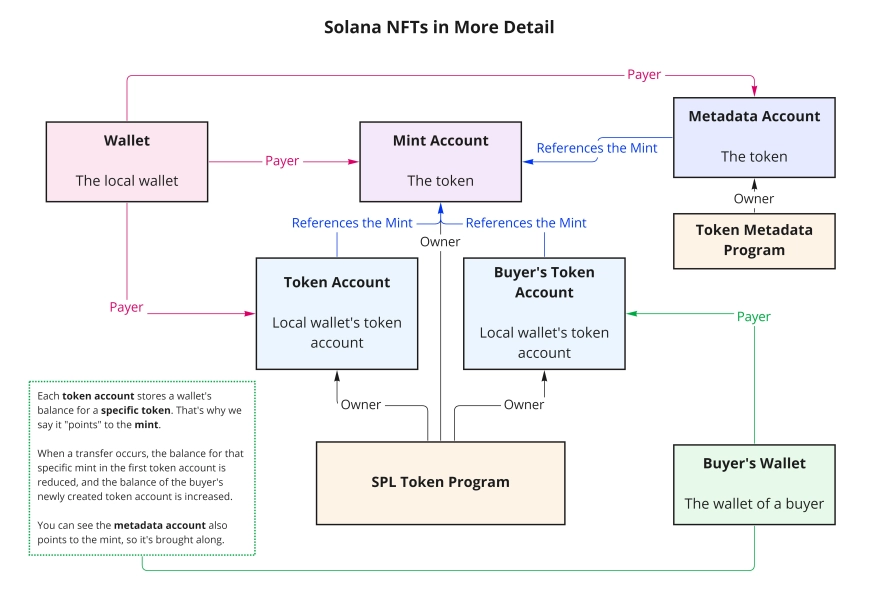

# Solana Intro Programs

Yet another repository, part of my journey to becoming a Rust Auditor/Blockchain Developer.

Here, I have documented and developed several Solana programs while following [these great tutorials](https://www.youtube.com/playlist?list=PLUBKxx7QjtVnU3hkPc8GF1Jh4DE7cf4n1).

## Programs

### Basic Concepts
Let’s start with some *basic rules* of Solana programs (smart contracts):
- In Solana, everything is an account, similar to Solidity and many other blockchains.
- A "smart contract" in Solana is often referred to as a **program**.
- Each account consists of a public and a private key.
- Accounts can either hold the bytecode of your programs (i.e., the raw logic of your smart contract) or store the state variables of a specific program. This differs from Solidity, where the contract itself holds its state.
- Program-derived data accounts (PDA), which store and manage program state, are created by programs themselves.
- Development and testing of Solana programs often take place directly on the devnet, as it's easier and similar to working in a local environment.

References:
- [Official Solana Documentation](https://solana.com/docs/core/accounts) - Well-formed and simply explained documentation regarding the basic concepts of Solana development.
- [Video Tutorials](https://www.youtube.com/playlist?list=PLUBKxx7QjtVnU3hkPc8GF1Jh4DE7cf4n1)

---

### `hello-solana`

This is my first Solana program written in Rust using the Solana Web3.js SDK—a basic "Hello World" example.

#### Key Points:
- Set up and configured the `Cargo.toml` file to use the Solana Rust SDK.
- Used the `entrypoint` macro to declare the main function that executes whenever a transaction or instruction is sent to our program (essentially, the account holding the program).
- Key parameters for the `process_instruction` function:
  - **`program_id`**: The public key of the current program.
  - **`accounts`**: An array of accounts passed in the transaction instructions when the transaction was sent to our program.
  - **`instruction_data`**: Additional data (in bytes) passed in the transaction.
- The simplest or most practical way to invoke our program is by using the JavaScript Web3 library for Solana, hence we also created a TypeScript client.
- The `client` code demonstrates how a transaction is constructed and sent to our program.
- In our client, we defined a `TransactionInstruction`, where we passed the `program_id`, `accounts` (`keys` field in the Solana Web3.js SDK), and `instruction_data` (`data` field in the Solana Web3.js SDK).

References:
- [Official Solana Documentation for Rust Programs](https://solana.com/developers/guides/getstarted/rust-to-solana)
- [Official Solana Documentation for JS Client](https://solana.com/docs/clients/javascript#interacting-with-custom-programs)
- [Solana Web3.js Documentation](https://solana-labs.github.io/solana-web3.js/)

---

### `math-stuff` and `advanced-math-stuff`

#### Key Points:
- The `math-stuff` program provides basic functionalities like **square** and **sum** operations.
- The `advanced-math-stuff` program extends `math-stuff` by adding **subtraction** and **division**. It introduces the concept of using `instruction_data` to determine which operation to perform, all within the same program.
- Both programs have **state**, which is stored in another account (commonly referred to as a [*data account*](https://solana.com/docs/core/accounts#data-account)), separate from the one holding the program bytecode.
- In the [`math.ts`](math-stuff/src/client/math.ts) file, you can see how the *client account* is created and passed into the `keys` field in `TransactionInstruction` — this account serves as our [data account](https://solana.com/docs/core/accounts#data-account).

References:
- [Official Solana Documentation](https://solana.com/docs/core/accounts#data-account) - Regarding the Solana account model.

---

### `transfer-sol`

This is a basic program for transferring SOL between accounts. You can refer to [the reference repo](https://github.com/Coding-and-Crypto/Rust-Solana-Tutorial/tree/master/transfer-sol) for more information on generating example accounts.

#### Key Points:
- Every account must have a **minimum balance** of SOL to exist on the blockchain. You cannot simply send one lamport to an account with a balance of **0 SOL**. You need to meet the minimum required balance so the account can store its data on-chain.
- The `system_program` module in the Rust Solana crate has many built-in programs to handle common operations, such as transferring SOL.
- In this program, multiple accounts are passed into the `TransactionInstruction`. Notably, one of the accounts must be marked as a **signer** to authorize the transaction.

References:
- [Solana Stack Exchange - Transfer SOL Simulation Error](https://solana.stackexchange.com/questions/7793/error-failed-to-send-transaction-transaction-simulation-failed-transaction-re)

---

### `mint-nft-raw`

This is the first program related to *NFTs* in this tutorial series, developed using vanilla Rust with the official Solana crates: `solana-program`, `spl-token`, `spl-associated-token-account`.

In the [first video related to NFTs](https://www.youtube.com/watch?v=3TXrrCAbRws&list=PLUBKxx7QjtVnU3hkPc8GF1Jh4DE7cf4n1&index=6&ab_channel=Coding%26Crypto), the CLI is used to *pseudo-create* an NFT token by following these steps:

1. **Create a Token Account**  
   This account will hold the related information. The token is created with 0 decimals to represent a unique item (essentially an NFT):
   ```bash
   spl-token create-token --decimals 0
   ```
   The structure of the information held in an [`spl_token`](https://docs.rs/spl-token/latest/spl_token/state/struct.Mint.html) (similar to ERC-20) at the time of writing looks like this:
   ```rust
   pub struct Mint {
       /// Optional authority used to mint new tokens.
       pub mint_authority: COption<Pubkey>,
       /// Total supply of tokens.
       pub supply: u64,
       /// Number of base 10 digits to the right of the decimal place.
       pub decimals: u8,
       /// Is `true` if this structure has been initialized
       pub is_initialized: bool,
       /// Optional authority to freeze token accounts.
       pub freeze_authority: COption<Pubkey>,
   }
   ```

2. **Create an Account for Your Wallet**  
   This account will hold information regarding the balance of the token created in step 1:
   ```bash
   spl-token create-account [token-pub-key]
   ```

3. **Mint Tokens**  
   Mint tokens into the account created in the previous step:
   ```bash
   spl-token mint [pub-key-of-data-account-for-your-token]
   ```

4. **Disable Minting**  
   Restrict further minting of the token, making you the only owner of the single minted token:
   ```bash
   spl-token authorize [token-pub-key] mint --disable
   ```

#### Key Points:
- The above four steps are essentially replicated in Rust, except that before creating a token account (step 1), you must first create a normal account (with sufficient storage to hold the structure shown above, which is 82 bytes in size).
- Once you create the regular account, you make it a *mint account* using the following command:
  ```rust
  invoke(
      &token_instruction::initialize_mint(
          &token_program.key,
          &mint.key,
          &mint_authority.key,
          Some(&mint_authority.key),
          0,
      ).unwrap(),
      &[
          mint.clone(),
          mint_authority.clone(),
          token_program.clone(),
          rent.clone(),
      ],
  )?;
  ```
- Pay close attention to the ownership of specific accounts:
  - Even though you create the token account, the [SPL Token program](https://spl.solana.com/token) is actually the owner of that account. The same applies to the account holding the balance of your custom tokens.
- Below is a diagram that illustrates the process, gathered from the [video series](https://www.youtube.com/watch?v=3TXrrCAbRws&list=PLUBKxx7QjtVnU3hkPc8GF1Jh4DE7cf4n1&index=6&ab_channel=Coding%26Crypto):



#### References:
- [SPL Token Documentation](https://spl.solana.com/token)
- [NFT Video Tutorial](https://www.youtube.com/watch?v=3TXrrCAbRws&list=PLUBKxx7QjtVnU3hkPc8GF1Jh4DE7cf4n1&index=6&ab_channel=Coding%26Crypto)
- [SPL Token Struct Documentation](https://docs.rs/spl-token/latest/spl_token/state/struct.Mint.html)
